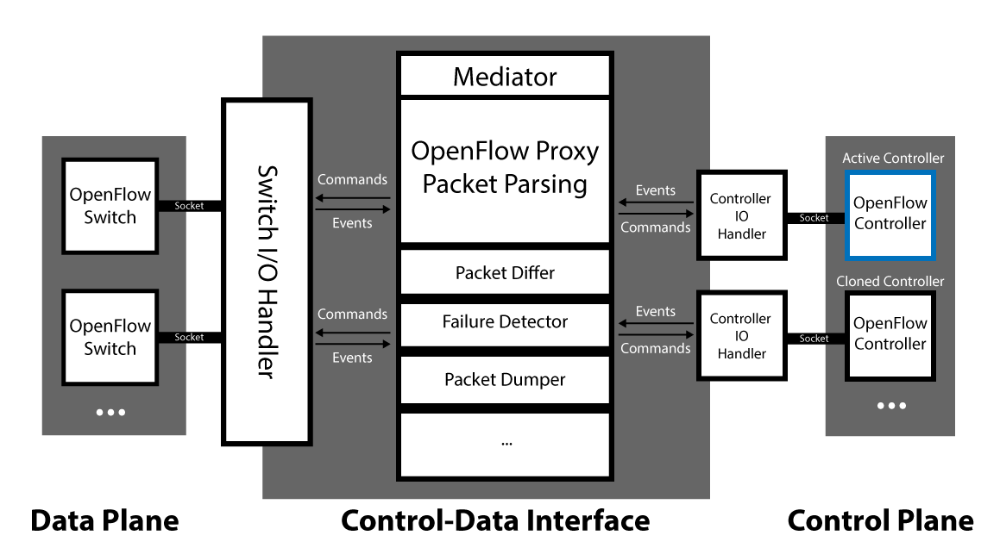
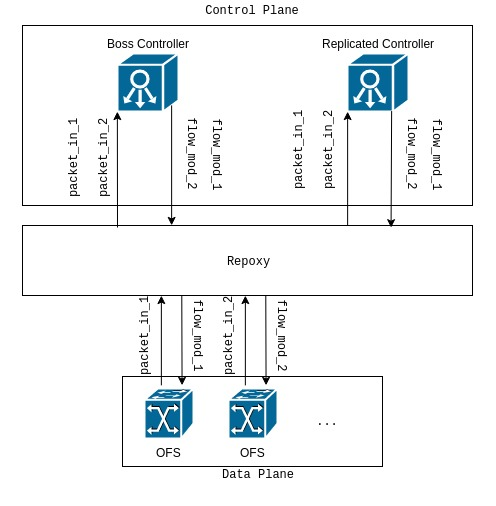
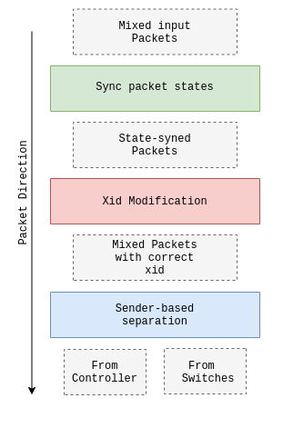
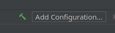
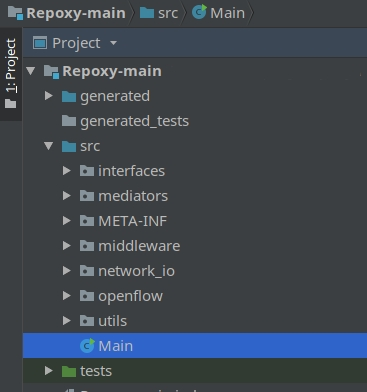
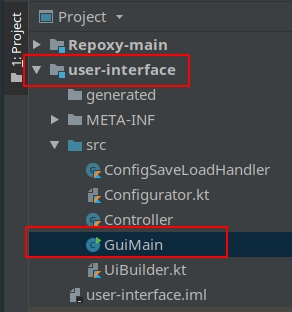

# Repoxy
The first proxy server enabling **multiple controllers** in one SDN network :sparkles:

Repoxy allows multiple OpenFlow (OF) SDN controllers to manage a single SDN network. Targeting increased reliability of the network, making the SDN network able to operate if its main controller fails without any need to sync the network state. (given that tehre's at least one other controller attached to Repoxy)

### Technical challenges
- Some OF protocol details needed to be handled
- Packets from controllers might arrive at different times with a different xid field for each OpnFlow conversation for each controller
- OF Packet Fabrication after Xid modification

This project is implmented for  [this](https://ieeexplore.ieee.org/document/8455887/) paper, published in IEEE TrustCom2018.


note: (This code isn't production ready).



*Full details are included in the paper*

The following images illustrate some of the architectural components and functionality of Repoxy

## Packet synchronization

If two controllers send a feature request packet, each one of the controllers will issue a different xid to the request packet. As the protocol specifies, the xid field must be the same in request & reply packets. 

Repoxy will wait the reply packet from the switch then modify the xid based on the ones assigned by each controller, then *refabricates* the reply packet with the correct xid corresponding to the controller's request. 
Before modifying the xid we must be sure that the state of the packets is synced, i.e. if we get 2 consecutive request packets from one controller (for example) the replies of the switch must be returned in the same order Repoxy has to figure out the reply packet corresponds to whiich request. With requests coming from switches and controllers, having more than one switch and more than one controller in the network, the task becomes tedious.




#### Development Tips
- I used [IntelliJ](https://www.jetbrains.com/idea/download/) IDEA for developing the project. There's a free version available and it makes things much easier
- After cloning the repo, hit the build button on the top right 
- Right click on the `Main` class from the right pane  <br> then select `Run Main.main()` if you want to use the GUI interface, do the same for `GuiMain` in `user-interface` module <br>
- Tests were done using `pox`controller and `mininet` network simulator
- don't forget to mark the `generated` directory as generated sources in the IDE 
- Test automation scripts are [here](https://github.com/shakram02/Repoxy-Scripts)
  - During my tests, I used 3 machines 2 of them are virtual, I placed the network simulated using mininet and Repoxy on my PC and hosted one controller on a VM. The test scripts simulate somoe scenarios and tries to make things more straight forward since switching between multiple VMs to make sure that everything starts on time was very boring to me.

#### Testing
- Start the two controllers and obtain their IPs and Port numbers
- Start repoxy after assigning the IPs and Port Numbers of the controllers, There is a GUI app that can facilitate the task
- When Repoxy starts it'll print out its IP and port
- Open mininet and establish your network, set the controller IP for each of the switches as Repoxy's IP
- Run mininet network and watch the logs.

#### Misc

Adding OpenFlow for `Wireshark` [here](http://xmodulo.com/monitor-openflow-messages.html)
Capture filter for `Wireshark`

```
tcp && not tcp.len==0 && (tcp.dstport==6833 || tcp.dstport==6834 || tcp.dstport==6835 || tcp.srcport==6833 || tcp.srcport==6834 || tcp.srcport==6835 )
```
