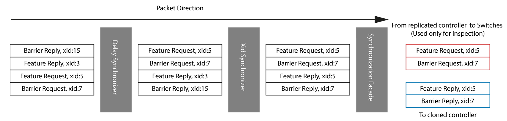

# Repoxy
This is code for [this](https://ieeexplore.ieee.org/document/8455887/) paper.


*Full details are included in the paper*

The following images illustrate some of the architectural components and functionality of Repoxy

## Packet modification to avoid switch/controller failures
Packets are ordered 



It's a special type of a proxy server that can attach multiple controllers to a given set of SDN switches. A task that seems to be easy but this is absolutely not true as there are some protocol details that need to be handled. (The code isn't production ready).


Adding OpenFlow for `Wireshark` [here](http://xmodulo.com/monitor-openflow-messages.html)
Capture filter for `Wireshark`

```
tcp && not tcp.len==0 && (tcp.dstport==6833 || tcp.dstport==6834 || tcp.dstport==6835 || tcp.srcport==6833 || tcp.srcport==6834 || tcp.srcport==6835 )
```

#### Development Tips
- don't forget to mark the `generated` directory as generated sources in the IDE 
